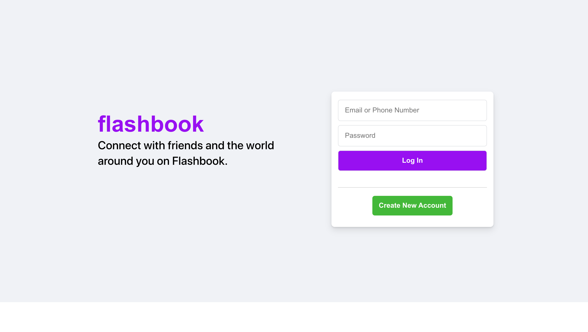

# Flashbook

**Flashbook** is a Full Stack Web App that is a remake of Facebook. Here users are able to sign up to our community, share their thoughts, and interact with other users and posts.

Built with React.js, Node.js with Express, and PostgreSQL.

## Features

Users are able to:

* Create or log-in to their own personalized account
* Search for and add any user on this platform as a friend
* Share their feelings by creating a post for their news feed
* Interact with their friends posts by sharing or leaving a reaction

## Future Implementations

## Technologies Used

* Node.js & Express.js
* Firebase
* PostgreSQL
* pg-promise
* CSS3
* React
* Redux Toolkit

